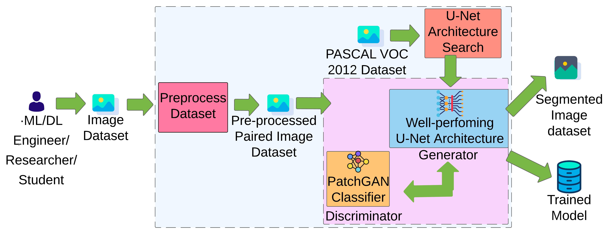

## iSegmentor
iSegmentor is a novel framework for semantic segmentation using Neural Architecture Search (NAS) and Generative Adversarial Networks (GANs).




## Requirements

+ asgiref
+ autopep8
+ django==2.2.10
+ pycodestyle
+ pytz
+ sqlparse
+ Unipath
+ dj-database-url
+ python-decouple
+ gunicorn
+ whitenoise
+ torch==1.7.1+cu110 torchvision==0.8.2+cu110 torchaudio===0.7.2 -f https://download.pytorch.org/whl/torch_stable.html
+ tqdm
+ numpy
+ pydicom
+ SimpleITK
+ Pillow
+ PyYAML
+ plotly
+ opencv-python
+ pygraphviz
+ graphviz
+ scipy
+ scikit-image
+ adabound
+ tensorboardX
+ schedule


## Features:

- [x] Multi GPU support for Senerator Achitecture Search
- [x] Multi GPU support for GAN based Segmentation Model Training
- [x] Segmengation Model Evaluation and Metrics Visualization Through GUI
- [x] Segemntation Reuslts Download and Metrics Download
- [x] Dataset, Search, Train Configuration Change through GUI
- [x] Dataset Upload or Sample Dataset is Available to Experiment
- [x] Real-time Metrics Visualization
- [x] Tensorboard Monitoring Integrated to GUI


## Usage

```bash
pip3 install -r requirements.txt
```

**Noticing**
> 
+ **1.** Display Cell Architecture 
    + If you use win10, and want to show the cell architecture with graph, you 
need install the pygraphviz and add ```$workdir$\\3rd_tools\\graphviz-2.38\\bin```
into environment path. Here ```$workdir$``` is the custom work directory. such as ```E:\\workspace\\NasUnet``` 
    + If you use ubuntu, install graphviz by : `sudo apt-get install graphviz libgraphviz-dev pkg-config`
    
After that install `pygraphviz` : `pip install pygraphviz`


+ **2.** If you use win10, and you also need to add the bin path of ```nvidia-smi``` to you environment path.
Because we will automatically choose the gpu device with max free gpu memory to run!.

+ **3.** If you want to use multi-gpus during training phase.
you need make sure the batch size can divide into gpus evenly.
which (may be pytorch bug!). For example, if you have 3 gpus, and the 
batch size need to be ```3, 6, 9 ... 3xM```.

+ **4.** When you meet CUDA OOM problems, the following tricks will help you:
    + A. set lower ```init_channels``` in configure file, such as ```16, 32, or 48```.
    + B. set lower ```batch_size``` such as ```2, 4, 6, 8```.
    + C. when you use a large image size, such as 480, 512, 720 et. al. the initial channels and batch size 
         may be much smaller.


### Search the architecture

```bash
cd experiment
# search on pascal voc2012
python train.py --config ../configs/nas_unet/nas_unet_voc.yml
```

### Evaluate the architecture on medical image datasets

+ train on promise12 dataset use nasunet
```bash
python train.py --config ../configs/nas_unet/nas_unet_promise12.yml --model nasunet
```

+ if you want to fine tune model:

```bash
python train.py --config ../configs/nas_unet/nas_unet_promise12.yml --model nasunet --ft
```

+ use multi-gpus

**edit configs/nas_unet/nas_unet_promise12.yml**

```yaml
training:
    geno_type: NASUNET
    init_channels: 32
    depth: 5
    epoch: 200
    batch_size: 6
    report_freq: 10
    n_workers: 2
    multi_gpus: True # need set to True for multi gpus
```

and then 

```bash
python train.py --config ../configs/nasunet/nas_unet_promise12.yml --model nasunet --ft
```

We will use the all gpu devices for training.

>Both in search and train stage, if you run in one gpu, we will find a max free gpu and transfer model to it.
So you can run N instances without manual set the device ids, if you have N gpu devices.

The final architectures of DownSC and UpSC we searched on pascal voc 2012.


### Custom your dataset

+ Firstly, normalize the custom dataset. you need `mean` and `std` see `util/dataset/calc_mean_std`

+ Secondly, add `CustomDataset` in `util/dataset/CustomDataset.py`

+ Finally, edit `util/dataset/__init__.py`, add your CutomDataset dataset and replace the 
`dir = '/train_tiny_data/imgseg/'` to `dir = '/your custom dataset root path/'`

## Citation

If you use this code in your research, please cite our paper.
```
@ARTICLE{8681706, 
author={Y. {Weng} and T. {Zhou} and Y. {Li} and X. {Qiu}}, 
journal={IEEE Access}, 
title={NAS-Unet: Neural Architecture Search for Medical Image Segmentation}, 
year={2019}, 
volume={7}, 
number={}, 
pages={44247-44257}, 
keywords={Computer architecture;Image segmentation;Magnetic resonance imaging;Medical diagnostic imaging;Task analysis;Microprocessors;Medical image segmentation;convolutional neural architecture search;deep learning}, 
doi={10.1109/ACCESS.2019.2908991}, 
ISSN={2169-3536}, 
month={},}
```


